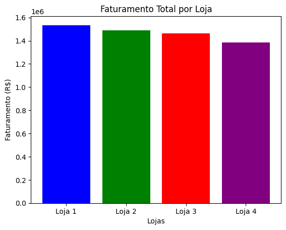
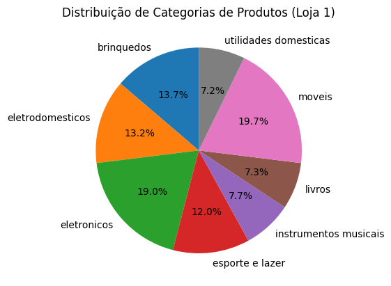
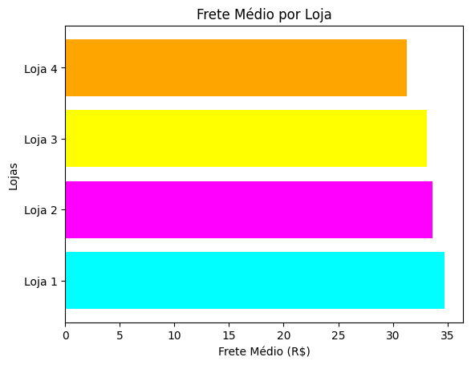

# Alura Store: Análise de Dados e Recomendações

## Propósito

Este projeto tem como objetivo analisar os dados de vendas de quatro lojas da Alura Store, com o intuito de identificar padrões, tendências e insights relevantes para o negócio. A partir dessa análise, o objetivo é fornecer uma recomendação estratégica sobre qual loja o Senhor João, proprietário da rede, deve vender, com base em seu desempenho e potencial de crescimento.

## Estrutura do Projeto

O projeto está organizado da seguinte forma:

* **ChallengeAluraStoreBr.ipynb:** Notebook Jupyter contendo todo o código da análise, incluindo importação de dados, tratamento, cálculos, geração de gráficos e conclusões.
* **datasets:** Pasta contendo os arquivos CSV com os dados de cada loja.

## Exemplos de Gráficos e Insights Obtidos

O projeto utiliza visualizações para apresentar os resultados da análise de forma clara e intuitiva. Alguns exemplos de gráficos e insights gerados:

* **Gráfico de Barras - Faturamento Total por Loja:** Permite comparar o faturamento de cada loja, identificando as mais e menos lucrativas.
  

* **Gráfico de Pizza - Distribuição de Categorias de Produtos:** Mostra a proporção de cada categoria de produto nas vendas de uma loja específica, revelando quais categorias são mais populares.

* **Gráfico de Barras Horizontais - Frete Médio por Loja:** Compara o custo médio de frete de cada loja, identificando aquelas com fretes mais altos ou mais baixos.

Além dos gráficos, o projeto apresenta insights sobre os produtos mais e menos vendidos, a média das avaliações de clientes por loja e outros dados relevantes para a tomada de decisão.

## Instruções para Executar o Notebook

Para executar o notebook Alura_Store.ipynb, siga estas instruções:

1. Faça o download do projeto e abra-o no Google Colab ou em seu ambiente Jupyter Notebook local.
2. Certifique-se de que as bibliotecas necessárias estejam instaladas (Pandas, Matplotlib). Caso não estejam, instale-as usando `pip install pandas matplotlib`.
3. Execute as células do notebook em ordem para realizar a análise, gerar os gráficos e visualizar os resultados.
4. Os dados das lojas estão na pasta `datasets`, na mesma estrutura de pastas que o notebook.

## Conclusões e Recomendações

O relatório final apresenta uma recomendação clara sobre qual loja o Senhor João deve vender, justificando a escolha com base nos dados e visualizações gerados. As conclusões consideram os pontos fortes e fracos de cada loja, levando em conta fatores como faturamento, popularidade de categorias de produtos, avaliações de clientes, produtos mais vendidos e frete médio.

## Próximos Passos

O projeto pode ser expandido e aprimorado com a inclusão de novas análises, como:

* Análise da sazonalidade das vendas.
* Previsão de vendas futuras.
* Segmentação de clientes.
* Implementação de modelos de Machine Learning para otimização de preços e estoque.

## Contribuições

Contribuições são bem-vindas! Sinta-se à vontade para abrir issues ou enviar pull requests com sugestões de melhorias, correções de bugs ou novas funcionalidades.
